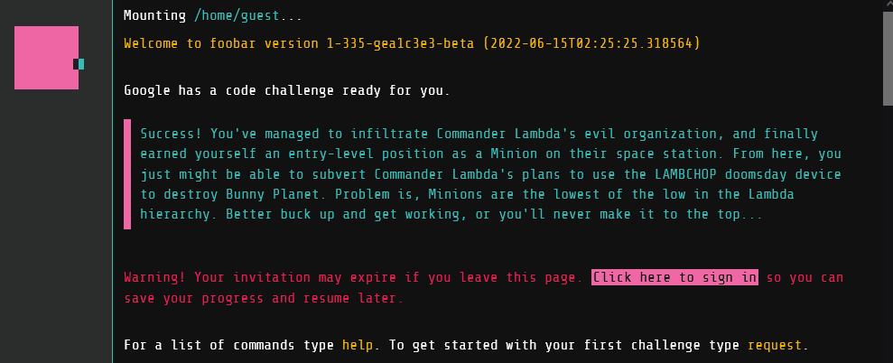
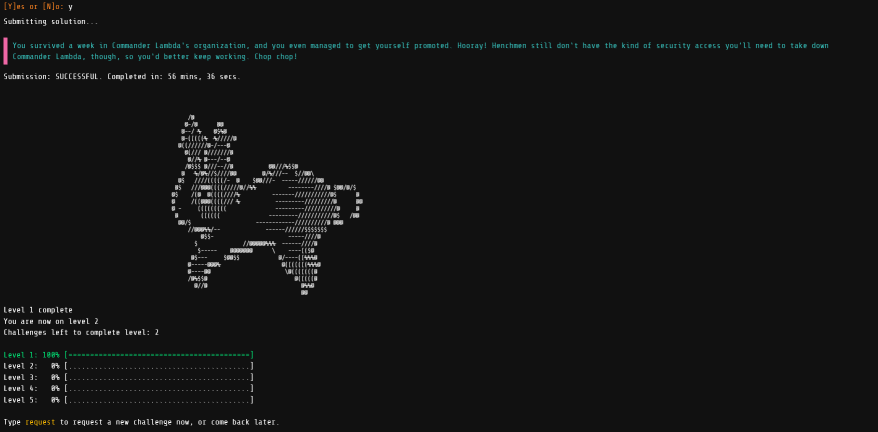

> I wrote this blog post near the beginning of the year. At the time, I had no intention of changing jobs, but I felt that it’d be a bit awkward to post about a recruiting tool. I chose to publish this the weekend before I start my new job to make it completely clear: this was just a fun coding exercise for me. Nothing more 🙂

You know that scene near the beginning of The Matrix where Neo is asleep at his keyboard, his monitor somehow projecting directly onto his face, when suddenly it blinks to an empty screen? Slowly, the words are typed out:

*Wake up, Neo . . .  
The Matrix has you . . .  
Follow the white rabbit.*  

And then **poof**, it’s gone. 

Well, the recruiters at Google certainly remember it. I was searching various reminders of syntax and documentation late one night while working on a hobby project when the top of my Google search flipped open to ask:

*Up for a challenge?*

## Let’s Play

I’m a curious person, so I click “I want to play”. The remainder of my Google search swings open and I find myself dropped into web-based terminal.

I log in and am told to type `request` to receive my first challenge, which would be timed. At this point it’s 11 PM, and while I’m a night owl, I was a bit worried of getting into a timed challenge without knowing what the limits would be. I knew that I'd be up for hours drowning in curiosity however, so against my better judgement I rand the command:

> Who would've guessed? Doomsday devices take a LOT of power. Commander Lambda wants to supplement the LAMBCHOP's quantum antimatter reactor core with solar arrays, and you've been tasked with setting up the solar panels.
> 
> 
> Due to the nature of the space station's outer paneling, all of its solar panels must be squares. Fortunately, you have one very large and flat area of solar material, a pair of industrial-strength scissors, and enough MegaCorp Solar Tape(TM) to piece together any excess panel material into more squares. For example, if you had a total area of 12 square yards of solar material, you would be able to make one 3x3 square panel (with a total area of 9). That would leave 3 square yards, so you can turn those into three 1x1 square solar panels.
> 
> Write a function solution(area) that takes as its input a single unit of measure representing the total area of solar panels you have (between 1 and 1000000 inclusive) and returns a list of the areas of the largest squares you could make out of those panels, starting with the largest squares first. So, following the example above, solution(12) would return [9, 1, 1, 1].

A bit silly, sure, but also something simple enough that I can knock out and head to bed. I look to the bottom-left corner of the screen and see a timer ticking down: 47h 58m 12s…11s…10s…

I'm given the option for each challenge to write your code in either Java 8 or Python 2.7.13. Along with the problem, I'm also provided a list of constraints:

1. Execution time is limited
2. Class imports are limited
3. Third-party libraries, IO operations, creating threads, and manipulating the environment are all prohibited

Finally, I'm given a couple of test cases to verify that your code is correct. I opted for Java, fired up VS Code, wrote a couple helper functions to run the test cases, and got to typing.

Once I completed the code, I flipped back into Foobar and typed `edit Solution.java` to pop up a nice little code editor completed with syntax highlighting. I pasted my code in and ran `verify Solution.java`, which runs the tests but doesn’t actually submit it as an answer.

This is where Google’s help ends. The `verify` command shows several additional tests are ran, along with which tests passed and which failed. In this first challenge it’s not really an issue. If you wrote a solution that satisfied the two given test cases, it probably fits the rest without issue. However, this becomes a challenge on its own in later levels. 

Since the `verify` command came back green, and I was satisfied with my code, I submitted it with `submit Solution.java` and I’m rewarded with...

…the white rabbit. A bit on the nose? Sure, but I’m a sucker for this sort of thing so it certainly got a chuckle. 

Level 1 complete, 4 more to go, right? Well…no. I notice the line “Challenges left to complete level: 2”. It turns out, the number of challenges per level varies. In total I believe I was given nine challenges. Some gave even more time, with the final challenge providing three full weeks to complete it. 

## What Are The Challenges, Exactly?

Some were questions which you can reasonably work through with some thought, some tinkering, and a splash of trial-and-error. A couple relied on knowing some very specific algorithms that I truthfully had never encountered, such as the [Ford-Fulkerson algorithm](https://en.wikipedia.org/wiki/Ford–Fulkerson_algorithm). 

Finally, a few we extremely math heavy. [Combinatorics](https://en.wikipedia.org/wiki/Combinatorics) and [group theory](https://en.wikipedia.org/wiki/Group_theory) were a couple of topics that I truthfully had to learn from scratch. I spent quite a bit of time learning [Burnside’s lemma](https://en.wikipedia.org/wiki/Burnside's_lemma) for example, despite the fact that I’m relatively sure I’ll never touch it again outside of the context of this challenge.

## What’s The Point?

At the core, this is a recruiting tool for Google. Once you complete the third challenge, you’re prompted with a question asking if you’d like to share your contact information with a Google recruiter. Completing challenges two and four gives you one-time-use access codes to share, which means more people for Google to potentially recruit. Personally I went through these challenges for two reasons: 

1. I was super curious what it was all about
2. I wanted to see if I could do it

## The Good, The Bad, The Ramblings

I do think the initial challenges walk a good line of reasonable tests for your skills as a coder and gave you reasonable time to complete them. They present challenges that allow you to get 90% of the way there and make you think about edge cases and how your code performs. For those that are looking to use this as a learning exercise, there’s a high chance you’ll be presented with something you may not have seen before.

From a presentation standpoint, it’s a really fun setup. There’s a running narrative that runs through all of the challenges, and the web interface is great to work with.

When you fail a test, you’re not told *why* you failed. It could be a wrong answer, it could be that it took too long to execute, it could be memory limitations, stack overflows, exceptions, etc. Really it’s an opaque box that’s left to the coder to figure out. I suppose for the purpose of the challenge that’s sort of the point, and one could argue that some of those things *should* be caught in your own tests. Some aspects like execution time never have their limitations defined, and I had a couple of answer where shaving off just a few milliseconds did the trick.

I’m no mathematician, very far from it. In fact, math was a subject I struggled with all throughout school. That said, I don’t mind where computer science intersects with math. In fact, it can result in some pretty interesting problems. The [Sieve of Eratosthenes](https://en.wikipedia.org/wiki/Sieve_of_Eratosthenes), the [Fast inverse square root](https://en.wikipedia.org/wiki/Fast_inverse_square_root), and the [Fast Fourier transform](https://en.wikipedia.org/wiki/Fast_Fourier_transform) all have an important place in my CS education. There were some math concepts however that I spent a non-trivial amount of time studying for these challenges however.

## A Final Thought

My last thought isn’t really a pro or a con. I did want to point out my time investment I took in this challenge, which was roughly four weeks off and on. I consider myself to have more free time than most, though I really only worked on it late at night. Perhaps I took my time more than most, but I question if the tradeoff is worth it, especially for those who's free time comes at a premium.

All of that said, this isn’t the *only* way of applying for a job at Google. In fact, it’s probably one of the least efficient ways you probably could. I’ve searched around to see how likely it is for those that submit their information to get a response, and it seems pretty rare. I think there’s certainly some food for thought on the tradeoffs of this system, but I think there’s a lot of data that I don’t have and I don't want to make too many assumptions.

All-in-all, I treated it exactly as if it were what I wanted to get out of it: a set of challenges to give me something to do in the evenings. I did learn a lot, and I had a good time taking a solution that (I assumed) was too slow and little-by-little shaving 10ms off of the execution time here, 20ms there. Even the refactoring process with the limitations of execution time had me implementing patterns that I didn’t think of initially, which in retrospect did have me thinking “oh duh, I should have done this initially!”

My two cents: If you stumble across this challenge, open to a new opportunity or not, take a swing at it. The first couple of challenges are pretty quick to knock out, but some of the later ones do give a pretty great feeling of accomplishment when you finally crack it. If you're looking at this as your "secret invitation to Google", I suggest you probably may want to tamper expectations and check out the job postings instead.