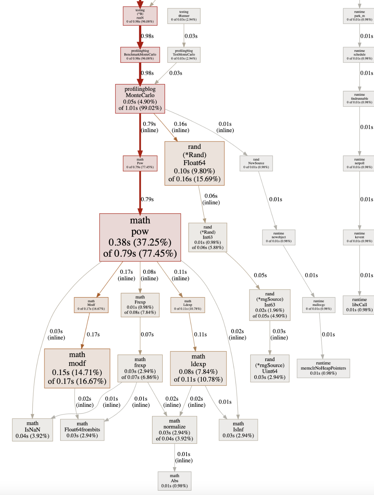

As a hobbyist Gopher, I still discover things about the language that surprise me. While working on a side project, I found myself trying to decide between two implementations where speed was a major factor. As it would turn out, Go actually has some great benchmarking tools! What better way to answer my question than to put them head-to-head?

In this blog, We'll work through a couple examples to learn exactly how to write these benchmarks, as well as how we dive deeper into the results. Overall speed is great, but what’s even better is getting to put things under a microscope and fine-tune them. Let’s start with how to write a benchmark with a simple example.

## Benchmark Building Blocks

Just as there are conventions for unit tests in Go, the same goes for writing benchmarks. These benchmarks can live right beside your unit tests, however instead of prefixing your benchmark methods with `Test`, you prefix it with `Benchmark`. Additionally, instead of taking in a `*testing.T` like a unit test, the benchmark expects an argument of type `*testing.B`. 

[The B type](https://pkg.go.dev/testing#B) provides a collection of methods (many of which overlap with [the T type](https://pkg.go.dev/testing#T) used in unit tests), including those to start, stop, and restart the benchmarking timer. It also includes one exported value: `N`. The `N` value is the number of iterations that your test should run your method. This can be controlled from the `go` CLI, but more on that later. Let’s start with a simple example and benchmark Go’s internal sorting algorithm.

```go
package main

import (
	"sort"
	"testing"
)

func BenchmarkSort(b *testing.B) {
	for n := 0; n < b.N; n++ {
		s := []int{5, 4, 3, 2, 1}
		sort.Ints(s)
	}
}
```

The `for` loop is the foundation of Go benchmarks. In this case, the test will run `b.N` iterations of the loop that allocates an array with five values and then calls `sort.Ints` on that array. We can run this test with the following command:

```bash
go test -bench=.
```

Which gives us the following:

```bash
goos: darwin
goarch: amd64
pkg: profilingblog
cpu: Intel(R) Core(TM) i9-9980HK CPU @ 2.40GHz
BenchmarkSort-16    	 9346909	       125.9 ns/op
PASS
ok  	profilingblog	1.407s
```

The line we’re interested in is the one starting with `BenchmarkSort-16`, which reports that it ran `9346909` iterations, averaging `125.9 ns` per operation, where an operation in this case is an iteration of the loop.

## Something With More Spice

This is great, but doesn't really show us a real example of something we'd like to improve. Let’s consider a [Monte Carlo method](https://en.wikipedia.org/wiki/Monte_Carlo_method) to estimate Pi. For those unfamiliar, Monte Carlo methods are a class of algorithms that use randomness to estimate a result. When [using this to estimate Pi](https://en.wikipedia.org/wiki/Monte_Carlo_method#Overview), we consider a square on a graph with a circle of a drawn inside of it. We then continually generate pairs of coordinates inside that square, and then calculate if the point would fall inside the circle. This leaves us with two numbers: The number of points inside the circle, and the number of points generated in total. 

I’ll leave the rest of the math as an [exercise for the reader](https://www.geeksforgeeks.org/estimating-value-pi-using-monte-carlo/), but the code looks a little something like this:

```go
func MonteCarlo(iterations int) float64 {
	randGen := rand.New(rand.NewSource(time.Now().UnixNano()))
	hitCount := 0

	for i := 0; i < iterations; i++ {
		x := randGen.Float64()
		y := randGen.Float64()
		hit := (math.Pow(x, 2) + math.Pow(y, 2)) <= 1.0
		if hit {
			hitCount++
		}
	}

	return (float64(hitCount) / float64(iterations)) * 4.0

}
```

This method takes in one argument: the number of iterations to run for the estimation. That is, the number of random points to generate. The more points we generate, the more accurate our estimate will be. The tradeoff is that a large number of iterations causes the estimation longer to calculate. We can then create a benchmark like we did previously, and provided it with a fairly arbitrary number of points to generate of `1000000`:

```go
func BenchmarkMonteCarlo(b *testing.B) {
	NUM_ITERATIONS := 1000000
	for n := 0; n < b.N; n++ {
		MonteCarlo(NUM_ITERATIONS)
	}
}
```

We can rerun the same `go test` command from before and we get the following result:

```bash
goos: darwin
goarch: amd64
pkg: profilingblog
cpu: Intel(R) Core(TM) i9-9980HK CPU @ 2.40GHz
BenchmarkMonteCarlo-16    	      21	  51714672 ns/op
PASS
ok  	profilingblog	1.399s
```

In this case, we see the benchmark only ran 21 iterations, each taking `51714672 ns`, or roughly 0.05 seconds per iteration. This is because by default, the benchmark will run for 1 second. For such a low number of iterations, we may want to let the benchmark run a bit longer. We can do this by adding the `-benchtime` flag and tell it to run for at least 30 seconds:

```bash
go test -bench=BenchmarkMonteCarlo -benchtime=30s
```

Running again, we get:

```bash
goos: darwin
goarch: amd64
pkg: profilingblog
cpu: Intel(R) Core(TM) i9-9980HK CPU @ 2.40GHz
BenchmarkMonteCarlo-16    	     622	  56345685 ns/op
PASS
ok  	profilingblog	41.134s
```

Our results remained roughly the same, but this time we ran 622 iterations. Benchmarks are a matter of averages though, so what if we wanted to run the test multiple times? In this case, we can add the `-count` flag

```bash
go test -bench=BenchmarkMonteCarlo -benchtime=30s -count=5
```

Which gives us the results of each individual test:

```bash
goos: darwin
goarch: amd64
pkg: profilingblog
cpu: Intel(R) Core(TM) i9-9980HK CPU @ 2.40GHz
BenchmarkMonteCarlo-16    	     601	  58418669 ns/op
BenchmarkMonteCarlo-16    	     597	  56513880 ns/op
BenchmarkMonteCarlo-16    	     640	  58050591 ns/op
BenchmarkMonteCarlo-16    	     682	  54049618 ns/op
BenchmarkMonteCarlo-16    	     668	  54076609 ns/op
PASS
ok  	profilingblog	208.017s
```

## Diving Deeper

Now that we have a baseline, it’d be nice to know what part of our method is the slowest. Once again, Go provides a great tool for us: [pprof](https://pkg.go.dev/runtime/pprof). This allows us to write CPU and memory profiling data to a file, which can be used by a visualization tool to make it easier to see where resources are being spent. In our case, we know that any bottleneck is most likely on the CPU, so let’s start there. We can enable CPU profiling with the `-cpuprofile` flag, passing it a file path to write the data.

```bash
go test -bench=BenchmarkMonteCarlo -cpuprofile cpu.prof
```

Then, we can use the following command to generate an SVG of the CPU profiling data:

```jsx
go tool pprof -svg cpu.prof > cpu.svg
```



There’s a lot going on here. Between the size of the boxes, the numbers on the edges, the percentages in each box, it’s a lot to take in at first. But even if we take an intuitive approach and assume “biggest box = most time”, we can see that `math.Pow` seems to be where a lot of time is spent, at least relative to everything else. Let’s take a look at the code again, and we can see only one occurrence of this call:

```go
hit := (math.Pow(x, 2) + math.Pow(y, 2)) < 1.0
```

This may seem innocent enough, and in most cases, it is! But remember, we’re not raising one arbitrary number to the power of another, we’re simply squaring the number. I encourage you to take a closer look at the code for [math.Pow](https://github.com/golang/go/blob/go1.18.5/src/math/pow.go#L45) (side-note, this changes a bit depending on the architecture you’re running on, and I stumbled across [this change](https://go-review.googlesource.com/c/go/+/310331) which gave some interesting insight on this). We see that `math.Pow` is more complicated than just “multiply *X* by itself *Y* times”, so what if we simplified things and did exactly that? 

We know in our case that `x` and `y` will always be values without much complication (floating-point arithmetic aside), so many of the checks and elegant math that’s implemented in the standard Go library just slows us down. Let’s change that line to the following:

```go
hit := ((x * x) + (y * y)) < 1
```

Let’s run our benchmark again and see how it compares to our initial runs:

```bash
go test -bench=BenchmarkMonteCarloSquare -benchtime=30s -count=5

goos: darwin
goarch: amd64
pkg: profilingblog
cpu: Intel(R) Core(TM) i9-9980HK CPU @ 2.40GHz
BenchmarkMonteCarloSquare-16    	    5912	   6287192 ns/op
BenchmarkMonteCarloSquare-16    	    5793	   6296169 ns/op
BenchmarkMonteCarloSquare-16    	    5862	   6046489 ns/op
BenchmarkMonteCarloSquare-16    	    5972	   6032723 ns/op
BenchmarkMonteCarloSquare-16    	    5974	   6055572 ns/op
PASS
ok  	profilingblog	184.875s
```

We can see an immediate *big* jump in performance. Even without comparing the per-operation timing, we can see that each 30-second run performed just under 10x the number of operations in total. We have one last tool that we can use to put this in context: [benchstat](https://pkg.go.dev/golang.org/x/perf/cmd/benchstat). This is a handy tool that will look at the results of two benchmarks and calculate the difference in performance for us. Let’s first install it using the Go CLI:

```bash
go install golang.org/x/perf/cmd/benchstat@latest
```

Then, we need to write the benchmark results to two files. For the sake of brevity, it would look something like this:

```bash
# Start with our initial math.Pow() implementation
go test -bench=BenchmarkMonteCarlo -benchtime=30s -count=5 | tee mc_pow.txt
# ... Update the code to square by multiplication
go test -bench=BenchmarkMonteCarlo -benchtime=30s -count=5 | tee mc_square.txt
```

Then, once we have our two files, we can feed them into `benchstat`, providing the old benchmark first followed by the new one: 

```bash
benchstat mc_pow.txt mc_square.txt

name           old time/op  new time/op  delta
MonteCarlo-16  59.7ms ± 9%   6.1ms ± 0%  -89.86%  (p=0.016 n=5+4)
```

With a delta of `-89.86%` we can see that our new implementation is *much* faster!

## Where Do We Go From Here?

There’s a lot more that we could get into, but I think we’ve covered quite a bit for one post. There’s a lot of great resources on profiling Go code that I’m still working through myself. A great starting place is [Profiling Go Programs on The Go Blog](https://go.dev/blog/pprof), as well as diving in more with [pprof](https://github.com/google/pprof), which also offers great features such as a web interface and the ability to generate flame graphs. Finally, you can [find all the code used in this blog on my GitHub](https://github.com/BrianMMcClain/profiling-go-blog). Thanks for reading!